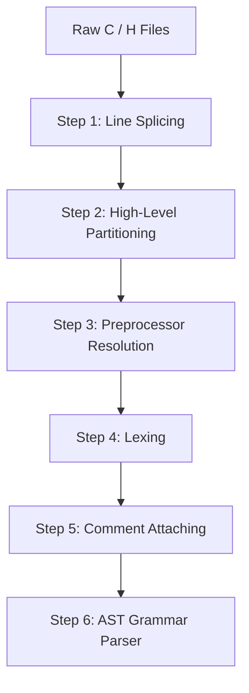

# Phase 1: Custom C Parser Plan

This phase parses all C and H files in the Doom codebase (`linuxdoom-1.10`) through a multi-step pipeline. Each step is applied iteratively across the entire codebase to guarantee 100% test coverage and fidelity before moving to the next.

---

## 🔄 Pipeline Overview



---

## 🛠️ Step-by-Step Breakdown

### Step 1: Line Splicing (Backslash Continuation)
* **Objective**: Stitch lines ending with a backslash (`\`) into a single logical line (C translation phase 2).
* **Key Considerations**:
  - Handle trailing backslashes followed by `\r\n` or `\n`.
  - Handle potential trailing whitespace between backslash and newline (per common compiler extensions).
  - Track original source spans / offsets so source line numbers can be mapped back accurately.
* **Validation Criteria**: Run across all 134 files in `linuxdoom-1.10` and verify zero corruption.

---

### Step 2: High-Level Partitioning (Lexical Chunks & Directives)
* **Objective**: Partition spliced source files into a sequence of classified chunks.
* **Target Enum Representation**:
  ```rust
  pub enum SourceChunk {
      Comment(Comment),
      StringLiteral(StringLiteral),
      Preprocessor(PreprocessorDirective),
      Code(String), // Unparsed C code chunk
  }

  pub enum Comment {
      Line(String),   // // line comment
      Block(String),  // /* block comment */
  }

  pub enum PreprocessorDirective {
      Include { path: String, is_system: bool },
      Define { name: String, params: Option<Vec<String>>, replacement: String },
      Undef(String),
      If(String),
      Ifdef(String),
      Ifndef(String),
      Elif(String),
      Else,
      Endif,
      Pragma(String),
      Error(String),
      Other { directive: String, rest: String },
  }
  ```
* **Key Considerations**:
  - Distinguish comments and preprocessor lines inside vs. outside string literals.
  - Correctly capture multiline macro definitions (`#define FOO(x) \ ...`).
* **Validation Criteria**: Parse all files into `Vec<SourceChunk>` and verify that reconstructing the source code matches the input.

---

### Step 3: Preprocessor Conditional Resolution
* **Objective**: Evaluate and resolve `#if`, `#ifdef`, `#ifndef`, `#elif`, `#else`, and `#endif` conditional compilation blocks.
* **Key Considerations**:
  - Maintain a preprocessor environment of defined symbols (e.g. `LINUX`, `NORMALUNIX`, `__BIG_ENDIAN__`).
  - Expression evaluator for integer expressions in `#if` and `#elif` (supporting `defined()`, arithmetic, logical operators).
  - Validation of properly nested conditional blocks across all Doom files.
  - Option to retain conditional branches in AST representation for multi-target transpilation.
* **Validation Criteria**: All Doom files evaluate cleanly with balanced conditional stacks under target macro definitions.

---

### Step 4: Lexing
* **Objective**: Lex the active (Step 3-resolved) chunks into a flat, ordered stream of C89 tokens and comments.
* **Key Considerations**:
  - Tokenize `Code` chunks into keywords, identifiers, numeric/string/char literals, and punctuators, each carrying a source span.
  - `Comment` chunks pass through as comment tokens, interleaved in original source order with the tokens around them (not yet attached to anything).
  - String/char literal chunks from Step 2 become literal tokens directly; no re-lexing of their escape sequences beyond what Step 2 already delimited.
* **Validation Criteria**: Lex every translation unit in `linuxdoom-1.10` into a token/comment stream with zero unrecognized characters.

---

### Step 5: Comment Attaching
* **Objective**: Attach each comment to the single token it documents, collapsing the token/comment stream from Step 4 into a stream of tokens only.
* **Attachment Rule**:
  - Lex the code into tokens and comments (Step 4's output).
  - If a token precedes a comment and both start on the same source line, attach the comment to that preceding token (trailing/inline comment).
  - Otherwise — the comment has no token before it on its line (e.g. it starts the line, or the file) — attach it to the token that follows it (leading/doc comment).
* **Target Representation**:
  ```rust
  pub struct Commented<T> {
      pub t: T,
      pub comments: Vec<Comment>,
  }
  ```
* **Validation Criteria**: Every comment in `linuxdoom-1.10` is attached to exactly one token; zero comments dropped or duplicated.

---

### Step 6: AST Grammar Parser
* **Objective**: Parse the `Vec<Commented<Token>>` stream into a typed Abstract Syntax Tree (AST).
* **Key Considerations**:
  - **Lexer Feedback & Symbol Table**: Handle the typedef vs. identifier ambiguity (`typedef_name * x;` vs `ident * x;`).
  - **Declarations**:
    - Primitives, structs, unions, enums, typedefs.
    - Function prototypes, forward declarations, variable declarations with initializers.
  - **Statements**:
    - `if` / `else`, `switch` / `case` / `default`.
    - Loops: `while`, `for`, `do ... while`.
    - Jumps: `goto`, `break`, `continue`, `return`.
    - Block scopes and compound statements.
  - **Expressions**:
    - Unary & Binary operators with standard C operator precedence.
    - Function calls, array indexing, member access (`.` and `->`), explicit casts.
  - Comments carried on each `Commented<Token>` should be preserved on (or reachable from) the AST node the token belongs to, so later stages can recover documentation.
* **Validation Criteria**: Complete AST construction for every translation unit in `linuxdoom-1.10`.
