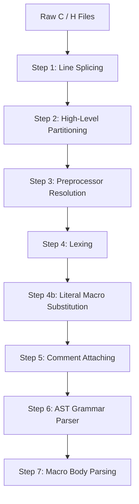

# Phase 1: Custom C Parser Plan

This phase parses all C and H files in the Doom codebase (`linuxdoom-1.10`) through a multi-step pipeline. Each step is applied iteratively across the entire codebase to guarantee 100% test coverage and fidelity before moving to the next.

---

## 🔄 Pipeline Overview



---

## 🛠️ Step-by-Step Breakdown

### Step 1: Line Splicing (Backslash Continuation)
* **Objective**: Stitch lines ending with a backslash (`\`) into a single logical line (C translation phase 2).
* **Key Considerations**:
  - Handle trailing backslashes followed by `\r\n` or `\n`.
  - Handle potential trailing whitespace between backslash and newline (per common compiler extensions).
  - Track original source spans / offsets so source line numbers can be mapped back accurately.
* **Validation Criteria**: Run across all 134 files in `linuxdoom-1.10` and verify zero corruption.

---

### Step 2: High-Level Partitioning (Lexical Chunks & Directives)
* **Objective**: Partition spliced source files into a sequence of classified chunks.
* **Target Enum Representation**:
  ```rust
  pub enum SourceChunk {
      Comment(Comment),
      StringLiteral(StringLiteral),
      Preprocessor(PreprocessorDirective),
      Code(String), // Unparsed C code chunk
  }

  pub enum Comment {
      Line(String),   // // line comment
      Block(String),  // /* block comment */
  }

  pub enum PreprocessorDirective {
      Include { path: String, is_system: bool },
      Define { name: String, params: Option<Vec<String>>, replacement: String },
      Undef(String),
      If(String),
      Ifdef(String),
      Ifndef(String),
      Elif(String),
      Else,
      Endif,
      Pragma(String),
      Error(String),
      Other { directive: String, rest: String },
  }
  ```
* **Key Considerations**:
  - Distinguish comments and preprocessor lines inside vs. outside string literals.
  - Correctly capture multiline macro definitions (`#define FOO(x) \ ...`).
* **Validation Criteria**: Parse all files into `Vec<SourceChunk>` and verify that reconstructing the source code matches the input.

---

### Step 3: Preprocessor Conditional Resolution
* **Objective**: Evaluate and resolve `#if`, `#ifdef`, `#ifndef`, `#elif`, `#else`, and `#endif` conditional compilation blocks.
* **Key Considerations**:
  - Maintain a preprocessor environment of defined symbols (e.g. `LINUX`, `NORMALUNIX`, `__BIG_ENDIAN__`).
  - Expression evaluator for integer expressions in `#if` and `#elif` (supporting `defined()`, arithmetic, logical operators).
  - Validation of properly nested conditional blocks across all Doom files.
  - Option to retain conditional branches in AST representation for multi-target transpilation.
* **Validation Criteria**: All Doom files evaluate cleanly with balanced conditional stacks under target macro definitions.

---

### Step 4: Lexing
* **Objective**: Lex the active (Step 3-resolved) chunks into a flat, ordered stream of C89 tokens and comments.
* **Key Considerations**:
  - Tokenize `Code` chunks into keywords, identifiers, numeric/string/char literals, and punctuators, each carrying a source span.
  - `Comment` chunks pass through as comment tokens, interleaved in original source order with the tokens around them (not yet attached to anything).
  - String/char literal chunks from Step 2 become literal tokens directly; no re-lexing of their escape sequences beyond what Step 2 already delimited.
* **Validation Criteria**: Lex every translation unit in `linuxdoom-1.10` into a token/comment stream with zero unrecognized characters.

---

### Step 4b: Literal Macro Substitution
* **Objective**: Substitute a `#define`d macro with its own literal token wherever the macro identifier sits immediately next to a real string/char literal in code -- the one place a missing macro definition actually breaks parsing (declaration-specifier positions are never ambiguous; only C89's adjacent-string-literal-concatenation grammar rejects a bare identifier sitting where only literals are valid). Deliberately narrow: **not** a general preprocessor macro expander. A macro used anywhere else (assigned to a variable, passed as a lone argument, referenced in another macro's body) is left as a plain identifier, unexpanded.
* **Resolution**: Mirrors Step 6b's treatment of `#include` as an import -- for a file, recursively unions its own top-level literal-bodied `#define`s (an object-like macro whose body is *just* one string- or char-literal token, e.g. `#define SAVEGAMENAME "doomsav"`) with those of everything it transitively `#include`s (memoized, cycle-guarded, reusing the same include resolution as Step 6b).
* **Substitution**: Walks the Step 4 token stream; for every `Identifier` token naming a resolved literal macro with a string/char literal token immediately before or after it (comments/directives in between don't count), replaces it in place with that macro's literal token. Once substituted, the token is a literal like any other, so Step 6c's existing adjacent-string-literal-concatenation handling picks up the rest automatically -- no separate concatenation logic needed.
* **Validation Criteria**: Confirmed via corpus analysis that exactly 4 macros across the whole codebase need this (`SAVEGAMENAME`, `DEVDATA`, `DEVMAPS`, `DOSY`, previously causing 3 files to fail Step 6c); with this step, all 62 `.c` translation units in `linuxdoom-1.10` now parse.

---

### Step 5: Comment Attaching
* **Objective**: Attach each comment to the single token it documents, collapsing the token/comment stream from Step 4 into a stream of tokens only.
* **Attachment Rule**:
  - Lex the code into tokens and comments (Step 4's output).
  - If a token precedes a comment and both start on the same source line, attach the comment to that preceding token (trailing/inline comment).
  - Otherwise — the comment has no token before it on its line (e.g. it starts the line, or the file) — attach it to the token that follows it (leading/doc comment).
* **Target Representation**:
  ```rust
  pub struct Commented<T> {
      pub t: T,
      pub comments: Vec<Comment>,
  }
  ```
* **Validation Criteria**: Every comment in `linuxdoom-1.10` is attached to exactly one token; zero comments dropped or duplicated.

---

### Step 6: AST Grammar Parser

`#include` is treated as an **import** (bringing type *names* into scope, like a module system), not textual inlining. This is the key design choice behind splitting Step 6 into three sub-steps, because it directly determines how the classic typedef-vs-identifier ambiguity (`typedef_name * x;` vs `ident * x;`) gets resolved: a bare leading identifier in a declaration-specifier position is *never* actually ambiguous at file scope, in a struct field, or in a parameter list (there's no other valid C89 production it could be there) -- it's only genuinely ambiguous **inside function bodies**, once you don't yet know whether that identifier names a type.

* **Step 6a -- Rough Parsing**: Scans each file's top level only, skipping over every `{ ... }` function body (brace-balanced, not parsed -- that's exactly where the real ambiguity lives, and bodies don't affect what a header exports anyway). Records every name introduced by a top-level `typedef`. Needs no typedef table at all, since top-level declaration-specifier positions are structurally unambiguous.
* **Step 6b -- Exported Types**: For a file, recursively unions its own Step 6a typedef names with the Step 6a names of everything it `#include`s (memoized, cycle-guarded). `#include "..."` (local) resolves relative to the including file's directory; `#include <...>` (system) is resolved the way a real preprocessor would -- searched for across the build machine's actual system include directories and, if found, processed the same way as any local header (recursively, following its own `#include`s too). If a system header genuinely isn't present, its typedefs are just missing rather than the whole thing failing; two hardcoded fallback tables (one hand-picked, one generated by resolving the real Xlib.h once and snapshotting the result) cover what this corpus needs even without those headers installed, so the outcome doesn't depend on the machine running it. See `docs/KNOWN_LIMITATIONS.md`.
* **Step 6c -- Actual AST**: Parses the `Vec<Commented<Token>>` stream into a typed Abstract Syntax Tree, with its typedef table seeded from Step 6b's resolved set instead of starting empty -- by the time it reaches a function body, the real typedef set is already known, so the ambiguity resolves correctly.
* **Key Considerations** (Step 6c):
  - **Declarations**:
    - Primitives, structs, unions, enums, typedefs.
    - Function prototypes, forward declarations, variable declarations with initializers.
  - **Statements**:
    - `if` / `else`, `switch` / `case` / `default`.
    - Loops: `while`, `for`, `do ... while`.
    - Jumps: `goto`, `break`, `continue`, `return`.
    - Block scopes and compound statements.
  - **Expressions**:
    - Unary & Binary operators with standard C operator precedence.
    - Function calls, array indexing, member access (`.` and `->`), explicit casts.
* **Validation Criteria**: Complete AST construction for every translation unit in `linuxdoom-1.10`. Only `.c` files are real translation units in C -- `.h` files are never compiled standalone, so this is checked over the 62 `.c` files, not all 124 `.c`/`.h` files. All 62 pass, deterministically (independent of what's installed on the machine running it), with Step 4b's narrow literal-macro substitution handling the last remaining gap (see `docs/KNOWN_LIMITATIONS.md`).

---

### Step 7: Macro Body Parsing
* **Objective**: Steps 1-6 deliberately never expand general `#define` macros (see `docs/KNOWN_LIMITATIONS.md`) -- a macro's replacement text sits in `PreprocessorDirective::Define { name, params, replacement }` as a raw, unparsed `String`, and a macro identifier used in code stays an unexpanded `Expr::Ident`/`Expr::Call` in the AST. This step turns that raw replacement text into a real `Expr`, using the same expression grammar Step 6c already parses code with -- so downstream consumers (starting with the typechecker's macro typing, `docs/02_TYPECHECKER.md`) work with structured expressions instead of strings. This is still purely syntactic: it produces an `Expr`, not a type -- assigning it a type is the typechecker's job, not the parser's.
* **Why after Step 6, not alongside Step 4b**: parsing a macro body as an expression needs the same typedef-vs-identifier disambiguation Step 6c's expression grammar already handles (e.g. `(fixed_t)(x)` parses differently as a cast depending on whether `fixed_t` is a known typedef name) -- so this step reuses Step 6c's expression parser directly, seeded with the same Step 6b typedef set as the file it belongs to, rather than duplicating that logic ahead of Step 6.
* **Object-like macros** (`#define FRACUNIT (1<<FRACBITS)`): lex the replacement text (Step 4) and parse it as a single expression. A macro is only ever used in code standing in for one syntactic expression, so the whole token stream must reduce to exactly one `Expr` with no leftover tokens -- if it doesn't (extra tokens after a complete expression, or a body that isn't expression-shaped at all, e.g. a type name or a statement), the macro is left unparsed rather than forced into a guess. A macro with *no* replacement text at all (`#define FOO`) is a distinct, common case -- a pure flag macro meaningful only to `#ifdef`/`defined()` -- and gets its own outcome rather than being lumped in with "failed to parse" (see `MacroBody::Empty` below).
* **Function-like macros** (`#define FixedMul(a,b) ...`): parse the parameter list (already captured as plain names in `params: Vec<String>`) alongside the body, with those parameter names in scope as ordinary identifiers while parsing the body expression -- they don't need to resolve to anything at this stage (no argument substitution happens here; that's per-call-site work the typechecker does once it knows each call site's actual argument expressions). Same single-expression requirement, and the same empty-body case, as the object-like case.
* **Target Representation**:
  ```rust
  pub enum MacroBody {
      Object(Expr),
      Function { params: Vec<String>, body: Expr },
      /// No replacement text at all -- a pure flag macro, not a body that
      /// failed to parse.
      Empty { params: Option<Vec<String>> },
      /// Had replacement text, but it didn't reduce to a single expression --
      /// kept for provenance/diagnostics, not a hard error (see
      /// `docs/KNOWN_LIMITATIONS.md`).
      Unparseable(String),
  }
  ```
* **Validation Criteria**: Every `#define` visible to (i.e. transitively reachable from) each of the 62 `.c` translation units gets parsed into a `MacroBody`; corpus scan reports how many resolve to `Object`/`Function`/`Empty` vs. fall back to `Unparseable`, matching Step 4b's "measure actual scope before deciding it needs more" methodology. Over the full corpus: 19015 object-like and 960 function-like macro occurrences parse to a single expression, 4459 are genuinely empty flag macros, and 1581 have real but non-expression-shaped bodies (statements, bare type names, ...) and stay `Unparseable`.
