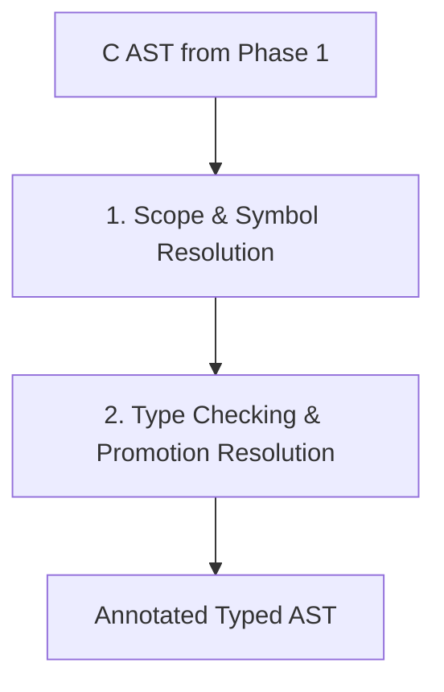

# Phase 2: Semantic Analysis & Typechecking Plan

Once C source files are parsed into an Abstract Syntax Tree (AST), the semantic analysis phase resolves symbols and verifies types before transpilation.

---

## 🎯 Goals
1. **Symbol Resolution**: Build lexical scopes and resolve all identifiers to their declarations (functions, global variables, local variables, struct/union members, enums).
2. **Type Representation**: Represent C types cleanly (integers, floats, pointers, arrays, structs, enums, function pointers, `const`/`volatile` qualifiers).
3. **Type Checking & Inference**:
   - Verify assignment compatibility and implicit conversions (e.g. integer promotions, pointer decay).
   - Resolve Doom-specific typedefs like `fixed_t`, `byte`, `boolean`, and action pointer types (e.g. `actionf_p1`).
   - Validate struct field offsets and alignment where necessary.

---

## 🏗️ Semantic Pipeline

---

## 📋 Key Modules & Tasks

### 1. Scope and Symbol Tables
- Global scope for external declarations and functions.
- File-level static scope (`static` functions and file-local variables).
- Local block scopes (functions, `{}` blocks).
- Tag namespace for `struct`, `union`, and `enum` tags.

### 2. Doom Idioms & Special Cases
- **Function Pointers**: Doom makes heavy use of state action pointers (`actionf_v`, `actionf_p1`, `actionf_p2`).
- **Fixed-Point Arithmetic**: `fixed_t` is a 16.16 fixed-point integer (`FRACUNIT` = 65536) used ubiquitously.
- **Zone Memory Management**: `Z_Malloc` and custom allocators that cast raw pointers into structs.
- **Bitfields & Flags**: Enum flags and bitwise masking.
