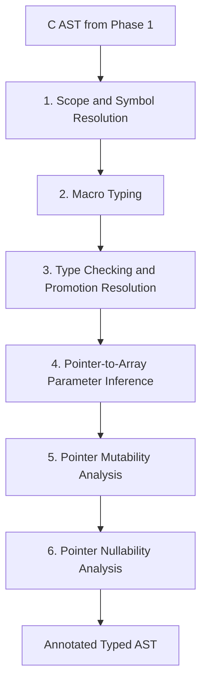

# Phase 2: Semantic Analysis & Typechecking Plan

Once C source files are parsed into an Abstract Syntax Tree (AST), the semantic
analysis phase resolves symbols, types macros, verifies types, and runs a set of
pointer-usage analyses whose results exist specifically to inform later Rust codegen
(Phase 3) — turning a raw pointer into `&[T]`, `&T`/`&mut T`, or `Option<&T>` isn't a
C concept, but the C source contains enough evidence (indexing, assignment-through,
NULL checks/passing) to infer it here rather than guessing at codegen time.

---

## 🎯 Goals
1. **Symbol Resolution**: Build lexical scopes and resolve all identifiers to their
   declarations (functions, global variables, local variables, struct/union members,
   enums).
2. **Type Representation**: Represent C types cleanly (integers, floats, pointers,
   arrays, structs, enums, function pointers, `const`/`volatile` qualifiers).
3. **Macro Typing**: Give every `#define` that's actually used in a typed context
   (object-like constants and function-like macros alike) a resolved type, the same
   way a real declaration gets one.
4. **Type Checking & Inference**:
   - Verify assignment compatibility and implicit conversions (e.g. integer
     promotions, pointer decay).
   - Resolve Doom-specific typedefs like `fixed_t`, `byte`, `boolean`, and action
     pointer types (e.g. `actionf_p1`).
   - Validate struct field offsets and alignment where necessary.
5. **Pointer Usage Analysis**: For every pointer-typed function parameter, infer three
   things a raw C signature doesn't tell you but Rust codegen needs: whether it's
   really used as an array, whether it's mutated through, and whether it can be null.

---

## 🏗️ Semantic Pipeline

---

## 🛠️ Step-by-Step Breakdown

### Step 1: Symbol Resolution & Scope Tables
* **Objective**: Build the scope structure every later step resolves identifiers
  against.
* **Scopes**:
  - Global scope for external declarations and functions.
  - File-level static scope (`static` functions and file-local variables).
  - Local block scopes (functions, `{}` blocks).
  - Tag namespace for `struct`, `union`, and `enum` tags (separate from the ordinary
    identifier namespace, per C89).
* **Key Considerations**:
  - Reuse Step 6b's import graph (`transpiler/src/parser/imports.rs`) so a symbol
    declared in an `#include`d header resolves the same way its typedefs already do.
  - Function parameters get their own scope nested directly inside the function body's
    block scope, per C89 scoping rules.
* **Validation Criteria**: Every identifier reference in every one of the 62 `.c`
  translation units resolves to exactly one declaration (or is reported as a genuine
  unresolved-symbol error).

---

### Step 2: Macro Typing
* **Objective**: Phase 1 deliberately does *not* expand general `#define` macros (see
  `docs/KNOWN_LIMITATIONS.md`) — Step 4b's literal substitution is narrowly scoped to
  parsing, and object-like macro constants (`#define FRACUNIT (1<<FRACBITS)`) and
  function-like macros (`#define FixedMul(a,b) ...`) still sit in the AST as
  unexpanded identifiers/call-shaped expressions. The typechecker is the first phase
  that actually needs their types, so this step gives every macro that's referenced
  from a typed context (an expression, a declaration) a resolved type.
* **Approach**:
  - For an object-like macro, parse its replacement text as a C89 constant expression
    (reusing Step 6c's expression grammar) and typecheck that expression to get its
    type — e.g. `FRACBITS` → `16` → `int`; `FRACUNIT` → `(1<<FRACBITS)` → `int` (after
    `FRACBITS` itself resolves).
  - For a function-like macro, parse its replacement text as a C89 expression with its
    parameter names in scope as placeholders, substitute the actual argument
    expressions' types at each use site (each call site can, in principle, get a
    different instantiation, the same way a C++ template would — a function-like
    macro has no single fixed signature), and typecheck the substituted expression.
  - Resolution mirrors Step 6b/4b's existing pattern: recursively union a file's own
    macros with everything transitively `#include`d, memoized and cycle-guarded,
    reusing `system_headers.rs`'s include resolution rather than reimplementing it.
* **Deliberately scoped, not a general preprocessor**: this is still not full
  macro-expansion of the token stream (Step 6's AST keeps macro call sites as-is,
  annotated with a resolved type, rather than inlining the macro body into the AST
  everywhere it's used). Macros whose body doesn't parse as a C89 expression (e.g. a
  multi-statement body, or one that expands to a partial/non-expression fragment) are
  left untyped and flagged, not hard errors — measure actual corpus impact the same
  way Step 4b did before deciding whether they need special handling.
* **Validation Criteria**: Corpus scan for every macro identifier referenced from an
  expression/declaration context across the 62 `.c` translation units; every one of
  them resolves to a type, or is explicitly logged as an untypeable macro body for
  follow-up (matching Step 4b's "measure first" methodology).

---

### Step 3: Type Checking & Promotion Resolution
* **Objective**: Verify assignment compatibility and implicit conversions across the
  now symbol-resolved, macro-typed AST.
* **Key Considerations**:
  - Integer promotions and the usual arithmetic conversions.
  - Pointer decay (array-to-pointer, function-to-pointer).
  - Resolve Doom-specific typedefs like `fixed_t`, `byte`, `boolean`, and action
    pointer types (e.g. `actionf_p1`, `actionf_p2`) down to their underlying
    representation for conversion purposes, while keeping the typedef name for
    diagnostics/codegen.
  - Validate struct field offsets and alignment where a cast or union access depends
    on layout.
* **Validation Criteria**: Every expression in every translation unit gets a resolved
  type; every assignment/cast/call-argument site is checked against C89 compatibility
  rules, with violations reported (not silently ignored) even where `linuxdoom-1.10`
  itself relies on undefined-ish behavior — see `docs/KNOWN_LIMITATIONS.md` for the
  policy on documenting rather than silently accepting deviations.

---

### Step 4: Pointer-to-Array Parameter Inference
* **Objective**: A C function parameter declared `T *p` is, at the language level,
  indistinguishable from "pointer to one `T`" and "pointer to the first element of a
  `T` array" — C itself never disambiguates this. Since Rust codegen (Phase 3) wants
  to emit `&[T]` / `&mut [T]` instead of a raw pointer wherever that's what the C code
  actually means, this step decides, per parameter, which one it is.
* **Evidence considered**:
  - Body usage: indexing (`p[i]`) or pointer arithmetic (`p + i`, `*(p + i)`) beyond
    single-step dereference implies array usage.
  - Call-site usage: an argument passed as an array name (which decays), an
    `&array[0]`, or a pointer already inferred as array-shaped from another call,
    implies array usage; an argument that's a single object's address (`&x`) implies
    non-array usage.
  - Conflicting evidence across call sites (same parameter treated as both a single
    pointer and an array depending on caller) is recorded per-call-site rather than
    forced into one answer — the annotation is a property of the pointer's *usage*,
    not purely of the declaration, and Phase 3 needs to know if it's ambiguous.
* **Key Considerations**:
  - Recursion into called functions is needed when a pointer parameter is just
    forwarded unchanged to another function — the inference has to follow the
    forwarding chain, not stop at the first call boundary.
  - This step only produces an annotation on the AST (array-shaped vs. single-object
    vs. ambiguous); it does not rewrite any declarations itself.
* **Validation Criteria**: Every pointer-typed function parameter across the corpus
  gets one of {array-shaped, single-object, ambiguous}, backed by the specific
  evidence (body access pattern and/or call sites) used to decide it, for later
  auditing.

---

### Step 5: Pointer Mutability Analysis
* **Objective**: Infer, for every pointer-like function argument, whether the function
  ever mutates through it — the C/Rust equivalent of choosing `&T` vs `&mut T` (or
  `const T *` vs `T *`, since `linuxdoom-1.10` is pre-ANSI-const-discipline C and
  rarely marks this explicitly itself).
* **Recursive, because pointer-ness nests**: a `sector_t *sec` argument whose body
  never reassigns `*sec`'s fields directly but does call `P_SetThingPosition(sec)`,
  which itself mutates through a field access, still needs to be classified as
  effectively mutating — so this has to follow: pointer-to-pointer chains, pointer
  fields inside a struct/union reached through the argument, and mutation performed
  by a called function on a pointer forwarded to it (same forwarding-chain logic as
  Step 4).
* **Key Considerations**:
  - Any write through the pointer (direct assignment, `++`/`--`, compound assignment,
    taking `&(*p).field` and passing it somewhere that itself mutates) counts as
    mutating.
  - A pointer only ever read through — including read-then-copied-elsewhere — is
    classified immutable.
  - Where a parameter's mutability can't be pinned down from static analysis alone
    (e.g. through a function pointer call whose target isn't known statically), fall
    back to the conservative answer (mutable) rather than under-report — matching the
    project's existing "fail soft, document the limitation" policy from Phase 1.
* **Validation Criteria**: Every pointer-typed function parameter across the corpus
  gets a mutable/immutable classification, each backed by the specific access (or
  call chain) that justified it.

---

### Step 6: Pointer Nullability Analysis
* **Objective**: Infer, for every pointer-like function argument, whether it can
  actually be null in practice — informing whether Phase 3 should model it as `&T` or
  `Option<&T>`.
* **Two independent sources of evidence, both checked**:
  - **Call-site evidence**: does any call site pass a literal `NULL`/`0`, an
    uninitialized-then-possibly-unset pointer, or another parameter/variable already
    classified as nullable?
  - **Body evidence**: does the function itself check the parameter against
    `NULL`/`0` before using it (implying the author expected it could be null), or
    does it dereference the parameter unconditionally on every path (implying the
    author assumed non-null, regardless of what callers actually pass)?
* **Key Considerations**:
  - The two sources can disagree (e.g. a function unconditionally dereferences a
    parameter, but some call site does pass a possibly-null pointer) — that's a real
    finding, not noise, and should be recorded as a conflict rather than silently
    resolved one way.
  - Same forwarding-chain requirement as Steps 4 and 5: a pointer parameter passed
    straight through to another function needs that function's nullability handling
    folded in.
  - Global/static pointers reachable from within the function body (not just
    parameters) are out of scope for this step — it's specifically about function
    *arguments*, both at the call site and within the body.
* **Validation Criteria**: Every pointer-typed function parameter across the corpus
  gets a nullable/non-nullable classification (or explicit conflict) from each
  evidence source independently, plus a combined verdict.

---

## 📋 Doom Idioms & Special Cases Feeding These Steps
- **Function Pointers**: Doom makes heavy use of state action pointers (`actionf_v`,
  `actionf_p1`, `actionf_p2`) — these interact with Step 4/5/6's forwarding-chain
  logic once the target of a call is itself unknown statically (see the conservative
  fallback in Step 5).
- **Fixed-Point Arithmetic**: `fixed_t` is a 16.16 fixed-point integer (`FRACUNIT` =
  `65536`) defined via object-like macros — a direct client of Step 2's macro typing.
- **Zone Memory Management**: `Z_Malloc` and custom allocators that cast raw pointers
  into structs — relevant to Step 4/6, since a freshly `Z_Malloc`'d pointer is
  non-null by construction at its allocation site but its nullability as a *parameter*
  elsewhere still needs the general analysis.
- **Bitfields & Flags**: Enum flags and bitwise masking, typed as part of Step 3.
