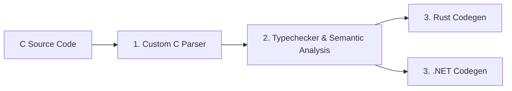

# Doom C-to-Rust / .NET Transpiler Roadmap

## 🎯 Project Goal
Transpile the classic Linux Doom C codebase (`linuxdoom-1.10`) into modern Rust (and subsequently .NET), following a staged compiler pipeline:

---

## 📑 Documentation Index

1. **[01. C Parsing Pipeline](01_PARSER.md)**
   - Step 1: Line Splicing (Backslash Continuation)
   - Step 2: High-Level Partitioning (Comments, Strings, Preprocessor Directives, Code Chunks)
   - Step 3: Preprocessor Conditional Resolution (`#if` / `#ifdef` / `#ifndef` / `#elif` / `#else` / `#endif`)
   - Step 4: Lexing (Tokens & Comments)
   - Step 5: Comment Attaching (`Commented<T>`)
   - Step 6: C89/C90 AST Grammar Parser

2. **[02. Semantic Analysis & Typechecking](02_TYPECHECKER.md)**
   - Symbol Tables and Scope Management
   - Macro Typing (object-like constants & function-like macros)
   - Type Representation & Checking, C Casts, Type Promotions, and Conversions
   - Pointer Usage Analysis: Array Inference, Mutability, and Nullability

3. **[03. Transpilation & Code Generation](03_TRANSPILER.md)**
   - Rust Code Generation Strategy (Safety, Ownership, Idioms vs. 1:1 Mapping)
   - .NET / C# Code Generation Strategy
   - Doom Runtime Support & Platform Layer

4. **[Known Limitations](KNOWN_LIMITATIONS.md)**
   - Deviations from strict C89 semantics accepted for now because they don't affect `linuxdoom-1.10`'s actual build
